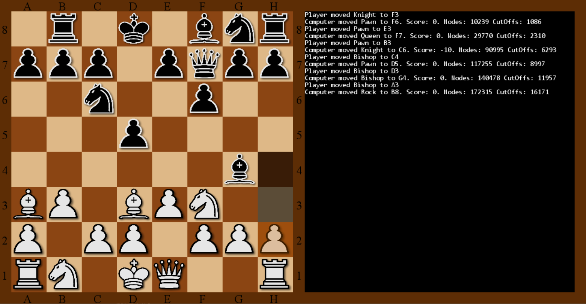

# ChessAI
A single player chess game where one can play agains a simple AI.

## Detailed Descriptions of each class:
### Main.Py
The Game class handles the loading of data, all user inputs, the drawings and animations of the chess pieces.
It uses an instance of the ChessEngine to store the placement of the pieces, and to handle all the chess related rules.

### ChessAI.py
The AI is based on the mini-max algorithm, with a max depth of 4 - i.e., 2 moves of both the computer and the player. I picked a maximum of 4 turns, because it was the highest number of turns which could be calculated fast enough for the game to still be enjoyable.

The gloabal variable `MAX_SEACH_DEPTH` can be increaces to make the game harder or decreased to make the game easier. It is located in "settings.py" file.

#### The mini-max Algorithm:
The mini-max algorithm calculates a score for all possible future moves and returns the move with the highest score.
My implementation also includes cut-offs, which gives the algorithm the ability to stop the search of a given branch if the score is such that it would be unreasonable to play that particular move.

### ChessEngine.py
My own implementation of a chess engine, which handles all the chess related rules, including:
- Keeping track of pieces
- Checking if a move is allowed
- Checking for occurences of chess and chessmate.

### TextPanel.py
Dispalys a panel of informational text about what was moved and by who. It also displays some information about the inner workings of the AI:
- Score: The calculated score by the mini-max algorithm. (If it is > 0 the computer is winnig and if it is < 0 the computer is loosing.)
- Nodes: The total number of checked moves.
- CutOffs: The number of nodes which has been cut-off of the search-tree.

## Controls:
- Hover over a piece to show the allowed moves.
- Left click to select piece.
- Right click to deselect piece.
- R restarts the game.
- Esc exits the game.

# What i have learned
- How to use different modules, specifically PyGame.
- How to implement a game engine.
- How the minimax algorithm works.

# Motivation for building the game:
I wanted to learn how to make and use a game enginee and at the same time learn about artificial intelligence. Based on these two criteria a chess game seemed like the ideal project.

# What the game looks like

